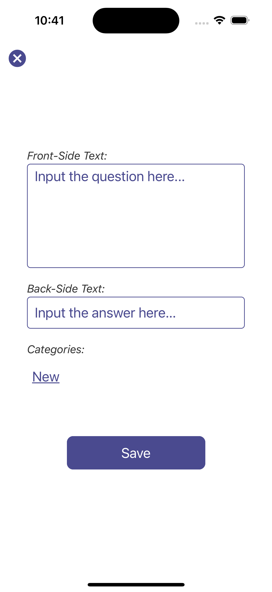

# Portfolioprüfung
_Erarbeitet im Rahmen des Modulbausteins "Moderne Programmierkonzepte" im Rahmen einer Vorlesung von Prof. Dr. Behrens an der DHBW Lörrach_

_Bearbeitet von: Jacob Ruhnau; Oktober-Dezember 2023_

---
#### TABLE OF CONTENTS
- [Introduction](#introduction)

## Einführung
### Voraussetzungen 
Im Rahmen des Studienschwerpunkts "Moderne Programmierkonzepte" an der DHBW Lörrach wurde die Aufgabe gestellt, eine App zu entwickeln, die es dem User ermöglicht. Es gab die Möglichkeit sich hierfür einen Usecase selbst zu bestimmen, in diesem Ansatz wurde der Vorschlag übernommen, welcher im Rahmen der Vorlesung angeboten wurde. Dieser Beschreibt eine Karteikarten App (vgl. [Requirements](docs/requirements.md)). 
Zielsetzung war es, dass alle MustHave-Requirements umgesetzt werden, wobei die Umsetzung durch zwei Personen erfolgen sollte.

### Besonderheiten
Unverhergesehen wurde die Gruppe auf eine Person reduziert, weshalb vereinbart wurde, dass zum Bestehen die Hälfte der Must-Have-Requirements umgesetzt werden muss. Die Umsetzung der Nice-To-Have-Requirements ist optional und kann zu einer Notenaufwertung führen.

React-Native wurde als Framework gewählt, da es eine gute Möglichkeit bietet, eine App für Android und iOS zu entwickeln. 
Diese App wurde allerdings bisher nur auf iOS 17.2 getestet innerhalb des expo-routers auf einem emulierten iPhone 15 innerhalb des X-Code Emulators (iOS 17.2).

### Übersicht der Requirements
Requirement                    | Kategorie  | Implementation | Dokumentation
---                            |---         |---             |---
Verwaltung: edit/create/delete | Must       |✅              |[link](#editcreatedelete)
Verwaltung: Korrekte Antwort   | Must       |⚠️               |[link](#korrekte-antwort)
Quiz: Dynamische Kartenanzahl  | Must       |✅              |[link](#quiz-kartenanzahl--kategorie-auswahl)
Quiz: Zufällige Kartenauswahl  | Must       |✅              |[link](#quiz-kartenanzahl--kategorie-auswahl)
Quiz: Boolsche Beantwortung    | Must       |✅              |vgl. [Korrekte Antwort](#korrekte-antwort)
---                            |---         |---             |---
Karten- / Lern-Kategorien      | NiceToHave |✅              |[link](#karten---lern-kategorien)
Cloudspeicherung               | NiceToHave |✅              |[link](#cloudspeicherung)
tbd | tbd | tbd | tbd

## Umsetzung
### App-Aufbau
Die App setzt sich Userseitig aus zwei Bereichen zusammen: Learning und Management. Im Learning-Bereich kann der User die Karten lernen, die er zuvor im Management-Bereich erstellt hat. Im Management-Bereich kann der User Karten erstellen, bearbeiten und löschen.

Description | Leerer Management Bereich | ---
--- | --- | ---
 | | 

Dieser Appentwurf sieht keine Beantwortung der Fragen durch, bei der eine Nutzereingabe evalueiert wird, vergleiche hierzu den Abschnitt [Korrekte Antwort](#korrekte-antwort).

Die Datensicherung wurde durch Firebase realisiert, wobei diese aktuell im "Test-Modus" konfiguriert ist und in einem "Ein-Benutzer-Modus" läuft. Dies bedeutet, dass jeder User auf die gleichen Daten zugreift, vergleiche hierzu [Cloudspeicherung](#cloudspeicherung).

### Verwaltung
#### Cloudspeicherung
Die Cloudspeicherung wurde durch Firebase realisiert. Hierbei wurde die Realtime-Database verwendet, da diese eine einfache Möglichkeit bietet, Daten zu speichern und zu lesen. Sie wurde in der componente [Firebase.js](mobile-app/components/Firebase.js) implementiert.

Der Zugriff auf die Datenbank erfolgt über die Funktionen `initDB()`, `getCards()`, `saveCard()`, `updateCard()` und `deleteCard()`.

Hierbei wurde die Datenstruktur wie folgt gewählt:
```
{
  "cards": {
    "cardId": {
      "front_text": "",
      "back_side": "",
      "text_3": "",
      "categories": [],
      "archived": 0,
    }
  }
}
```

In der aktuellen Implementierung finden die Attribute `text_3` und `categories` keine Verwendung. `archived` könnte verwendet, um Karten zu archivieren, so dass sie nicht mehr bei einem Quiz beachtung finden. `text_3` lönnte verwendet werden, um einen Hinweis zur Lösung zu geben.

Die Authorisierung findet hartkodiert durch einen API-key statt.


#### edit/create/delete
Die Verwaltung der Karten erfolgt im Management-Bereich, welcher auch als Startseite der App dient. Hier kann der User Karten erstellen, bearbeiten und löschen, wofür sich ein Modal einblendet welches in [NewCard.js](mobile-app/components/NewCard.js). 

Leere `NewCard.js` | Leerer Management Bereich | NewCard mit wählbaren Kategorien
--- | --- | ---
 | | 

Die Karten werden in einer Liste angezeigt, wobei die die Informationen der Vorderseite und die Rückseite ersichtlich ist, wobei eine Karte durch die Komponente [ManageCard.js](mobile-app/components/ManageCard.js) dargestellt wird. Diese Implementiert ein `TouchableOpacity`-Element, welches bei einem Klick auf die Karte die Detailansicht öffnet, welche wieder durch die Komponente [NewCard.js](mobile-app/components/NewCard.js) dargestellt wird, nun sind die Attribute editierbar.

#### Karten- / Lern-Kategorien
Die Möglichkeit, eine Karte mit Kategorien zu versehen bietet erhelblichen Mehrwert für den User.

Eine Karte kann keine, einer oder mehreren Kategorien angehören, welche als Array gespeichert werden. Es können beliebige benutzerdefinierte Kategorien hinzugefügt werden.
Dies wird mit der Komponente [CategorySelector.js](mobile-app/components/CategorySelector.js) realisiert, welche in verschiedenen Ansichten verwendet wird. Sie besteht aus einem Horizontal-`ScrollView`, welcher die Kategorien anzeigt.  
Die Komponente erhält das Karten-Array sowie die Zustandsvariablen `selectedCategories` und `availableCategories` und , welche die ausgewählten Kategorien enthält. Die Verfügbaren Kategorien werden aus den Verfügbaren Karten extrahiert und zur Auswahl Angeboten, etwaig schon ausgewählte Kategorien sind farbig Markiert, die Darstellung und Kategorisierung erfolgt dynamisch.

### Quiz
Default `NewSession.js`|  Eingestellte Kartenanzahl & Kategorie-Auswahl
--- | ---
 | 

#### Quiz: Kartenanzahl & Kategorie-Auswahl
Im Lernmodus besteht im Start-Screen zum einen die Übersicht über die in der aktuellen Sitzung letzet Erfolgsquote (Anzahl der korrekt/inkorrekt beantworteten Fragen) sowie die Möglichketi eine neue "Session" zu definieren. 

Dies erfolgt durch eine weitere Komponente [NewSession.js](mobile-app/components/NewSession.js) welcher `NewCards.js` entlehnt ist. Die Kategorie-Auswahl erfolgt durch die Komponente [CategorySelector.js](mobile-app/components/CategorySelector.js), wobei die Auswahl der Katogierien auch die Kartenanzahl beeinflusst.

Sollte die Kartenanzahl unter der Anzahl der verfügbaren Karten liegen, so werden die Karten zufällig ausgewählt.

Frontseite der Karte | Antwort-Dialog | Ergebnis
--- | --- | ---
 | | 

#### Korrekte Antwort
Dieser Enwurf sieht im Quiz-Modus keine Evaluierung der Antwort vor. Dies bedeutet, dass der User die Antwort selbst beantwortet und anschließend die Karte "umdreht", um die Antwort zu sehen. Die Implementierung hier ist aktuell noch durch einen `Alert`-Dialog realisiert und bietet somit noch Ausbau-Potential. 

#### Boolsche Beantwortung
[vgl. Korrekte Antwort](#korrekte-antwort)


